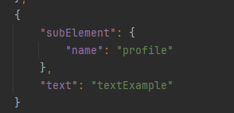

# **README File**
<a id="readme-top"></a>

## **Intellij-script-for-setup-runners**

Intellij-script-for-setup-runners is a tool for intellij to build the runner from a json file.

<p align="right">(<a href="#readme-top">back to top</a>)</p>

## **Introduction**

Intellij-script-for-setup-runners is a project that makes the creation of the runners in the intellij be more agile and automatic, additionally maintaining the runners is easier as the json file is that we need to change.

<p align="right">(<a href="#readme-top">back to top</a>)</p>

## **Installation**

To install Intellij-script-for-setup-runners, follow these steps:

1. Clone the repository: **`git clone https://github.com/dariojorge/Intellij-script-for-setup-runners.git`**
2. Navigate to the project directory: **`cd Intellij-script-for-setup-runners`**
3. **Copy** the file **IntellijBuildEnvironementRunners.py**
4. In the Intellij project, create the folder **scripts** in the root project
5. Put the IntellijBuildEnvironementRunners.py file inside
6. Create a json file envVariables.json

<p align="right">(<a href="#readme-top">back to top</a>)</p>

## **Usage**

To use Intellij-script-for-setup-runners, follow these steps:

1. Open the project in your favorite code editor.
2. Open the file **runners.json**.
3. Add the runners settings in the json
4. Run the python script with the command `py IntellijBuildEnvironementRunners.py`
5. Use the project as desired.

<p align="right">(<a href="#readme-top">back to top</a>)</p>

## **How to setup the json file**

For the json file we have a few rules for the setup:

1. The root file needs to be `configuration` and it is an array:
```Json
{
    "configuration": []
}
```

2. Each node has a subElement, text and a element:    


- The subElement is the attributes of the node:
    - Json example  
    
    - Xml example
    
- The element is where we define the child nodes:
    - Json example   
    
    - Xml example  
    
- The text is where we define the value for the node:
    - Json example   
    
    - Xml example    
    
3. The element will have the nodes required for the runner, example:
    
- In the example we have the module and the option, this will create the xml nodes module and option.
    

<details>

<summary>Json Example</summary>

```Json
{
    "configuration": [
        {
            "subElement": {
                "name": "RunnerExample",
                "type": "QuarkusRunConfiguration",
                "factoryName": "QuarkusRunConfiguration"
            },
            "element": {
                "module": {
                    "subElement": {
                        "name": "module name"
                    }
                },
                "option": [
                    {
                        "subElement": {
                            "name": "env"
                        },
                        "element": {
                            "map": {
                                "element": {
                                    "entry": {
                                        "subElement": {
                                            "key": "LOG_LEVEL",
                                            "value": "INFO"
                                        }
                                    }
                                }
                            }
                        }
                    },
                    {
                        "subElement": {
                            "name": "profile"
                        },
                        "text": "textExample"
                    }
                ]
            }
        }
    ]
}
```

</details>
<details>

<summary>Xml Example</summary>

```Xml
<configuration name="RunnerExample" type="QuarkusRunConfiguration" factoryName="QuarkusRunConfiguration">
    <option name="env">
        <map>
            <entry key="LOG_LEVEL" value="INFO" />
        </map>
    </option>
    <module name="module name" />
    <option name="profile">textExample</option>
    <method v="2" />
</configuration>
```

</details>

<p align="right">(<a href="#readme-top">back to top</a>)</p>

## **License**

Distributed under the MIT License. See `LICENSE.txt` for more information.

<p align="right">(<a href="#readme-top">back to top</a>)</p>

## **Changelog**

See `CHANGELOG.md` for more information.

<p align="right">(<a href="#readme-top">back to top</a>)</p>

## **Authors and Acknowledgment**

Intellij-script-for-setup-runners was created by **[Dário Jorge](https://github.com/dariojorge)**.

<p align="right">(<a href="#readme-top">back to top</a>)</p>

## **FAQ**

**Q:** Does the Script deletes all the custom runners?

**A:** Yes, as the json is used to maintain the runners it needs ti delete the runners before for a fresh update.

<p align="right">(<a href="#readme-top">back to top</a>)</p>